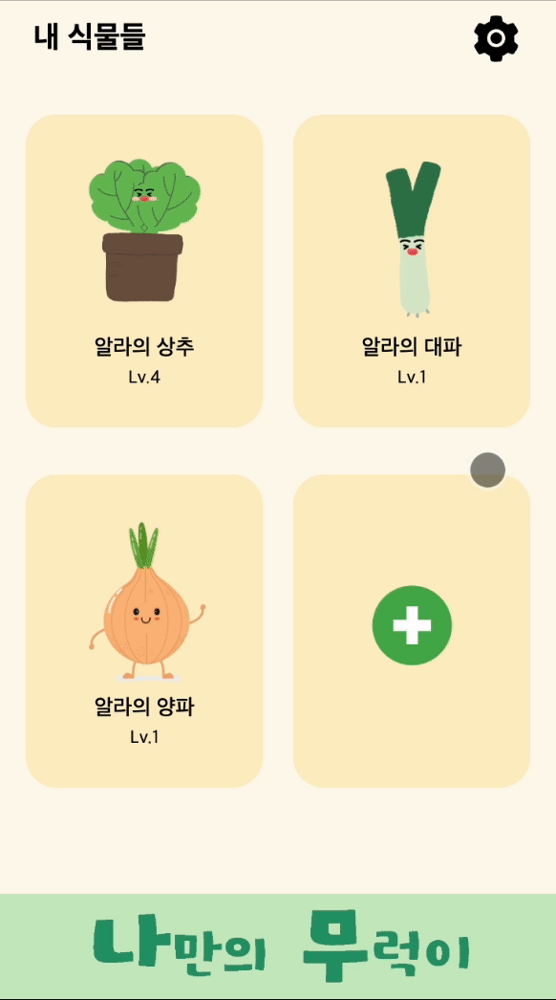
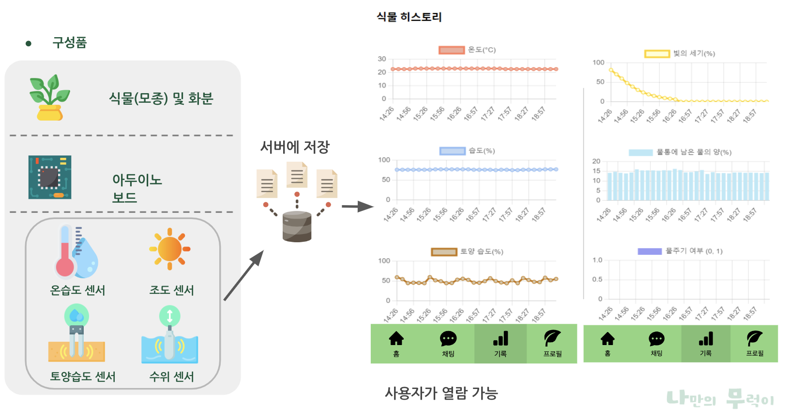
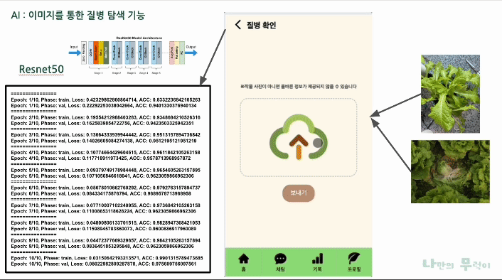
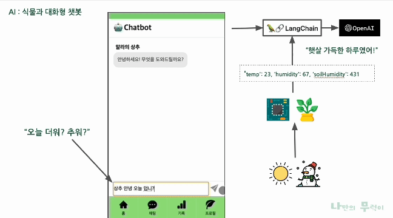

> 식물을 꾸준히 키우는 데 도움을 주는 서비스

## 기획 계기

다들 식물을 키워보신 경험이 있나요?

식물을 키울 때 다양한 어려움이 발생합니다. 현재 나의 식물 상태가 궁금한데 알 방법이 없고, 처음엔 그렇게 관심을 많이 줬는데 시간이 흐르면 물 주는 걸 깜빡하거나 방치하게 되는 일을 겪으신 분들이 있을 겁니다.

그래서 저희는 이러한 문제점들을 해결하고자 웹 애플리케이션, 인공지능, 아두이노를 활용하여 식물을 스마트하고 재밌게 키울 수 있는 서비스를 기획하게 되었습니다.

 

## 서비스 소개

**나만의 무럭이**의 주요 기능으로는 다음과 같습니다:

- **맞춤형 식물 관리 정보 제공**: 사용자의 식물에 맞는 맞춤형 관리 정보를 제공합니다.
- **실시간 모니터링 및 기록**: 센서를 이용하여 식물 상태를 실시간으로 모니터링하고 기록합니다.
- **퀘스트 및 알림 기능**: 식물 관리에 필요한 퀘스트와 알림을 통해 사용자가 식물을 안정적으로 관리할 수 있도록 도와줍니다.
- **식물과의 대화**: 실제 식물 데이터를 기반으로 학습된 AI와의 대화를 통해 사용자에게 식물과 상호작용하는 재미를 제공합니다.

이러한 기능들을 통해 사용자는 식물과 상호작용하는 즐거움을 느끼고, 식물을 지속적으로 키울 수 있도록 도와줍니다.

 

## 개발 기간

### 2024.03.28 ~ 2024.06.01 (9주)

 

## 팀 구성

<table>
  <tr >
    <td align="center" width="200px" >
      
    </td>
    <td align="center" width="200px" >
      
    </td>
    <td align="center" width="200px" >
      
    </td>
    <td align="center" width="200px" >
      
    </td>
    <td align="center" width="200px" >
      
    </td>
    <td align="center" width="200px" >
      
    </td>
  </tr>
  <tr>
    <td align="center" width="200px" >
      <a href="https://github.com/sanghee01/"><strong>이상희</strong></a> Frontend
    </td>
    <td align="center" width="200px" >
      <a href="https://github.com/maybeaj/"><strong>이효진</strong></a> Frontend
    </td>
    <td align="center" width="200px" >
      <a href="https://github.com/nemokoala/"><strong>박재연</strong></a> Backend
    </td>
    <td align="center" width="200px" >
      <a href="https://github.com/Isonade2/"><strong>전준영</strong></a> Backend
    </td>
    <td align="center" width="200px" >
      <a href="https://github.com/leeyeonju02/"><strong>이연주</strong></a> AI
    </td>
    <td align="center" width="200px" >
      <a href="https://github.com/dlrhdns75177/"><strong>이고운</strong></a> AI
    </td>
  </tr>
</table>
 

 

## 기술 스택

 

## 서비스 아키텍처

> 클라이언트, Spring WAS 서버, Python Flask 서버, 그리고 MySQL 데이터베이스가 유기적으로 연결되어 작동합니다. 이를 통해 사용자는 식물의 상태를 쉽게 모니터링하고, 필요한 정보를 얻을 수 있습니다.

#### 클라이언트

- 클라이언트는 리액트로 만든 정적 웹 페이지를 Vercel 웹서버를 통해 제공받습니다.

#### 서버

- 대부분의 API 통신은 AWS EC2에 배포된 Spring WAS 서버를 통해 이루어지며, 이때 데이터는 MySQL 데이터베이스에 저장됩니다.

#### 하드웨어

- 식물 기록 측정을 위한 하드웨어인 아두이노는 WiFi를 통해 원격으로 Spring 서버에 센서 측정 값을 전송합니다. 이 정보 역시 MySQL 데이터베이스에 저장되고 웹을 통해 언제든지 확인이 가능합니다.

#### 인공지능

- 질병 분류 기능: 클라이언트에서 이미지를 플라스크 서버로 바로 전송을 하면 이미 학습시킨 모델을 통해 이미지를 분석하여 질병 분류 결과를 반환해줍니다.

- 챗봇 기능: 식물과 대화할 수 있는 챗봇 기능은 클라이언트에서 채팅을 시작하면, Flask 서버는 Spring 서버에 현재 식물의 상태를 요청하여 정보를 받아온 후, 이를 바탕으로 상황에 맞게 답변을 생성하여 클라이언트로 반환합니다.

 
 

## 주요 기능

### 시작하기

|                                                            회원가입                                                            |                   메일 인증                    |                                                                                로그인 & 로그아웃                                                                                |
| :----------------------------------------------------------------------------------------------------------------------------: | :--------------------------------------------: | :-----------------------------------------------------------------------------------------------------------------------------------------------------------------------------: |
| &nbsp;&nbsp;&nbsp;&nbsp;&nbsp;&nbsp;&nbsp;&nbsp;&nbsp;&nbsp;&nbsp;&nbsp;&nbsp; |  | &nbsp;&nbsp;&nbsp;&nbsp;&nbsp;&nbsp;&nbsp;&nbsp;&nbsp;&nbsp;&nbsp;&nbsp;&nbsp;&nbsp;&nbsp;&nbsp;&nbsp;&nbsp;&nbsp; |

 

### 식물 입양

 

### 홈

|                식물 터치 이벤트                 |                                                                                    알림                                                                                    |                                                                                         퀘스트                                                                                          |
| :---------------------------------------------: | :------------------------------------------------------------------------------------------------------------------------------------------------------------------------: | :-------------------------------------------------------------------------------------------------------------------------------------------------------------------------------------: |
|  | &nbsp;&nbsp;&nbsp;&nbsp;&nbsp;&nbsp;&nbsp;&nbsp;&nbsp;&nbsp;&nbsp;&nbsp;&nbsp;&nbsp;&nbsp;&nbsp;&nbsp;&nbsp;&nbsp;&nbsp; | &nbsp;&nbsp;&nbsp;&nbsp;&nbsp;&nbsp;&nbsp;&nbsp;&nbsp;&nbsp;&nbsp;&nbsp;&nbsp;&nbsp;&nbsp;&nbsp;&nbsp;&nbsp;&nbsp;&nbsp;&nbsp;&nbsp;&nbsp; |

 

#### 원격 수분 공급 기능

|              물주기 버튼 클릭 시              |                                                                        원격 수분 공급                                                                        |
| :-------------------------------------------: | :----------------------------------------------------------------------------------------------------------------------------------------------------------: |
|  | &nbsp;&nbsp;&nbsp;&nbsp;&nbsp;&nbsp;&nbsp;&nbsp;&nbsp;&nbsp;&nbsp;&nbsp;&nbsp;&nbsp;&nbsp;&nbsp;&nbsp; |

 

### 식물 히스토리

 

### 식물 페이지

|                                                             식물 프로필 & 출석 체크                                                              |                   식물 도감                    |                       명예의 전당                        |
| :----------------------------------------------------------------------------------------------------------------------------------------------: | :--------------------------------------------: | :------------------------------------------------------: |
| &nbsp;&nbsp;&nbsp;&nbsp;&nbsp;&nbsp;&nbsp;&nbsp;&nbsp;&nbsp;&nbsp;&nbsp;&nbsp;&nbsp;&nbsp;&nbsp; |  |  |

 

### AI

 

 
